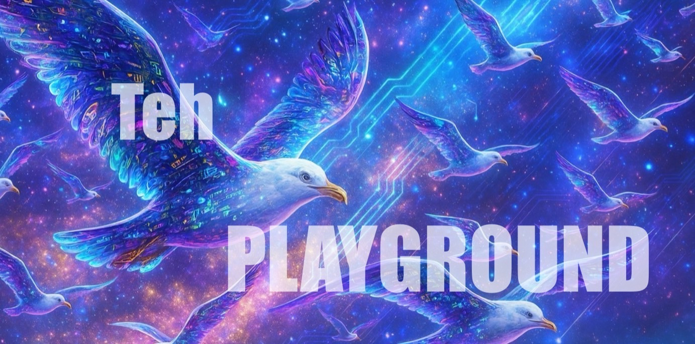

  <h1>
    
    Teh Playground
    
  </h1>

  
  Welcome to the playground! This is a space using the Hextra template where you can practice before participating in the actual QOM Wiki editing. Try things out—edit the code and submit a pull request from GitHub. It’s okay if things don’t go perfectly. &nbsp; 
  Just enjoy and let's get started!!
  

  

  
    Teh Builders
  



  

  <!-- add your card below -->


